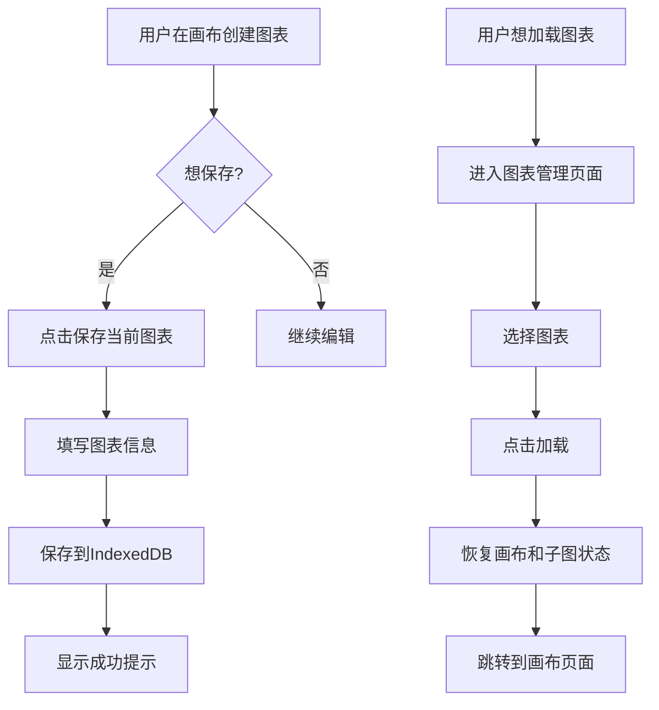

# 图表保存与加载功能开发计划

## 📋 需求概述

实现一个完整的图表管理系统，允许用户：
- 保存当前画布及所有关联子图的完整状态（包括数据、配置、参数）
- 管理多个已保存的图表
- 从图表列表中选择并加载特定图表
- 重命名、删除已保存的图表

---

## 🎯 技术方案选择

### 方案对比

| 方案 | 优点 | 缺点 | 推荐度 |
|------|------|------|--------|
| **LocalStorage** | 简单，无需后端，即时可用 | 容量限制（~5-10MB），无法跨设备 | ⭐⭐⭐ |
| **IndexedDB** | 大容量，支持复杂查询 | API复杂，需要封装 | ⭐⭐⭐⭐⭐ |
| **后端数据库** | 可跨设备，支持协作 | 需要后端开发，增加复杂度 | ⭐⭐⭐⭐ |
| **文件导出/导入** | 便于分享，无容量限制 | 需要手动管理文件 | ⭐⭐⭐ |

### 推荐方案：**IndexedDB + 文件导出/导入**

**核心理由**：
1. **IndexedDB** 作为主要存储方式
   - 容量大（通常几百MB）
   - 支持结构化数据存储
   - 异步操作，不阻塞UI
   - 支持事务和索引

2. **文件导出/导入** 作为辅助功能
   - 便于备份和分享
   - 可以跨设备迁移
   - 作为 IndexedDB 的补充

---

## 📊 数据结构设计

### 1. 图表数据模型

```typescript
interface SavedChart {
  // 图表元数据
  id: string;                    // 唯一ID（UUID）
  name: string;                  // 图表名称
  description?: string;          // 图表描述
  thumbnail?: string;            // 缩略图（Base64或URL）
  createdAt: number;             // 创建时间戳
  updatedAt: number;             // 更新时间戳
  tags?: string[];               // 标签（用于分类和搜索）
  
  // 画布配置
  canvas: CanvasConfig;          // 画布设置
  
  // 子图数据
  subplots: SubplotConfig[];     // 所有子图配置和数据
  
  // 版本信息
  version: string;               // 数据格式版本（用于迁移）
}
```

### 2. IndexedDB 数据库设计

```typescript
// 数据库名称：chart-class-charts
// 版本：1

// Object Store: charts
{
  keyPath: 'id',
  indexes: {
    'by-name': { unique: false },
    'by-createdAt': { unique: false },
    'by-updatedAt': { unique: false },
    'by-tags': { unique: false, multiEntry: true }
  }
}
```

---

## 🏗️ 架构设计

### 1. 目录结构

```
frontend/
├── lib/
│   └── db/
│       ├── index.ts              # IndexedDB 封装
│       ├── chartDB.ts            # 图表相关数据库操作
│       └── types.ts              # 数据库类型定义
├── store/
│   └── chartStore.ts             # 图表状态管理（Zustand）
├── components/
│   └── chart/
│       ├── ChartList.tsx         # 图表列表
│       ├── ChartCard.tsx         # 图表卡片
│       ├── ChartDialog.tsx       # 保存/编辑对话框
│       ├── ChartImport.tsx       # 导入图表
│       └── ChartExport.tsx       # 导出图表
└── app/
    └── charts/
        └── page.tsx              # 图表管理页面
```

### 2. 核心模块

#### A. IndexedDB 封装层 (`lib/db/chartDB.ts`)

```typescript
class ChartDatabase {
  // 初始化数据库
  async init(): Promise<IDBDatabase>
  
  // CRUD 操作
  async saveChart(chart: SavedChart): Promise<void>
  async getChart(id: string): Promise<SavedChart | null>
  async getAllCharts(): Promise<SavedChart[]>
  async updateChart(id: string, updates: Partial<SavedChart>): Promise<void>
  async deleteChart(id: string): Promise<void>
  
  // 查询操作
  async searchCharts(query: string): Promise<SavedChart[]>
  async getChartsByTag(tag: string): Promise<SavedChart[]>
  
  // 工具方法
  async exportChart(id: string): Promise<Blob>
  async importChart(file: File): Promise<SavedChart>
  async clearAll(): Promise<void>
}
```

#### B. 图表状态管理 (`store/chartStore.ts`)

```typescript
interface ChartStore {
  // 状态
  charts: SavedChart[];
  currentChart: SavedChart | null;
  isLoading: boolean;
  
  // 操作
  loadCharts: () => Promise<void>;
  saveCurrentAsChart: (name: string, description?: string) => Promise<void>;
  loadChart: (id: string) => Promise<void>;
  deleteChart: (id: string) => Promise<void>;
  updateChartMetadata: (id: string, updates: Partial<SavedChart>) => Promise<void>;
  
  // 导入/导出
  exportChart: (id: string) => Promise<void>;
  importChart: (file: File) => Promise<void>;
}
```

---

## 🎨 UI/UX 设计

### 1. 主要页面

#### A. 图表管理页面 (`/charts`)

**布局**：
```
┌─────────────────────────────────────────┐
│  📁 我的图表                            │
│  [🔍 搜索] [+ 新建图表] [⬆️ 导入]      │
├─────────────────────────────────────────┤
│  ┌──────┐  ┌──────┐  ┌──────┐          │
│  │缩略图│  │缩略图│  │缩略图│          │
│  │图表1 │  │图表2 │  │图表3 │          │
│  │📅日期│  │📅日期│  │📅日期│          │
│  │[加载]│  │[加载]│  │[加载]│          │
│  │[编辑]│  │[编辑]│  │[编辑]│          │
│  │[删除]│  │[删除]│  │[删除]│          │
│  │[导出]│  │[导出]│  │[导出]│          │
│  └──────┘  └──────┘  └──────┘          │
└─────────────────────────────────────────┘
```

**功能**：
- 网格或列表视图切换
- 搜索和过滤
- 排序（按时间、名称）
- 批量操作

#### B. 保存图表对话框

```typescript
// 表单字段
{
  name: string;           // 图表名称（必填）
  description: string;    // 图表描述（可选）
  tags: string[];         // 标签（可选）
  generateThumbnail: boolean; // 是否生成缩略图
}
```

#### C. 画布页面集成

在现有的侧边栏中添加：
- **保存当前图表** 按钮
- **加载存档图表** 下拉菜单（显示最近的图表）

### 2. 用户流程



---

## 🔧 实施步骤

### Phase 1: 基础架构（2-3天）

#### 1.1 IndexedDB 封装
- [ ] 创建 `lib/db/index.ts` - 基础数据库工具
- [ ] 创建 `lib/db/chartDB.ts` - 图表数据库操作
- [ ] 创建 `lib/db/types.ts` - 类型定义
- [ ] 编写单元测试

**关键代码示例**：
```typescript
// lib/db/chartDB.ts
import { openDB, IDBPDatabase } from 'idb';

const DB_NAME = 'chart-class-charts';
const DB_VERSION = 1;
const STORE_NAME = 'charts';

export class ChartDatabase {
  private db: IDBPDatabase | null = null;

  async init() {
    this.db = await openDB(DB_NAME, DB_VERSION, {
      upgrade(db) {
        if (!db.objectStoreNames.contains(STORE_NAME)) {
          const store = db.createObjectStore(STORE_NAME, { keyPath: 'id' });
          store.createIndex('by-name', 'name');
          store.createIndex('by-createdAt', 'createdAt');
          store.createIndex('by-updatedAt', 'updatedAt');
          store.createIndex('by-tags', 'tags', { multiEntry: true });
        }
      },
    });
  }

  async saveChart(chart: SavedChart) {
    if (!this.db) await this.init();
    await this.db!.put(STORE_NAME, chart);
  }

  async getAllCharts(): Promise<SavedChart[]> {
    if (!this.db) await this.init();
    return this.db!.getAll(STORE_NAME);
  }

  // ... 其他方法
}

export const chartDB = new ChartDatabase();
```

#### 1.2 Zustand 状态管理
- [ ] 创建 `store/chartStore.ts`
- [ ] 实现基础状态和操作
- [ ] 集成 IndexedDB

**关键代码示例**：
```typescript
// store/chartStore.ts
import { create } from 'zustand';
import { chartDB } from '@/lib/db/chartDB';
import { useCanvasStore } from './canvasStore';

interface ChartStore {
  charts: SavedChart[];
  currentChart: SavedChart | null;
  isLoading: boolean;

  loadCharts: () => Promise<void>;
  saveCurrentAsChart: (name: string, description?: string) => Promise<void>;
  loadChart: (id: string) => Promise<void>;
  deleteChart: (id: string) => Promise<void>;
}

export const useChartStore = create<ChartStore>((set, get) => ({
  charts: [],
  currentChart: null,
  isLoading: false,

  loadCharts: async () => {
    set({ isLoading: true });
    try {
      const charts = await chartDB.getAllCharts();
      set({ charts, isLoading: false });
    } catch (error) {
      console.error('Failed to load charts:', error);
      set({ isLoading: false });
    }
  },

  saveCurrentAsChart: async (name, description) => {
    const canvasState = useCanvasStore.getState();
    
    const chart: SavedChart = {
      id: crypto.randomUUID(),
      name,
      description,
      createdAt: Date.now(),
      updatedAt: Date.now(),
      canvas: canvasState.canvas,
      subplots: canvasState.subplots,
      version: '1.0',
    };

    await chartDB.saveChart(chart);
    await get().loadCharts();
  },

  loadChart: async (id) => {
    const chart = await chartDB.getChart(id);
    if (chart) {
      const canvasStore = useCanvasStore.getState();
      canvasStore.reset();
      set({ canvas: chart.canvas, subplots: chart.subplots });
      set({ currentChart: chart });
    }
  },

  deleteChart: async (id) => {
    await chartDB.deleteChart(id);
    await get().loadCharts();
  },
}));
```

### Phase 2: UI 组件开发（3-4天）

#### 2.1 图表卡片组件
- [ ] 创建 `components/chart/ChartCard.tsx`
- [ ] 支持缩略图显示
- [ ] 添加操作按钮（加载、编辑、删除、导出）

#### 2.2 图表列表组件
- [ ] 创建 `components/chart/ChartList.tsx`
- [ ] 实现网格和列表视图
- [ ] 添加搜索和过滤功能
- [ ] 添加排序功能

#### 2.3 保存对话框
- [ ] 创建 `components/chart/ChartDialog.tsx`
- [ ] 表单验证
- [ ] 缩略图生成（使用 html2canvas）

#### 2.4 导入/导出组件
- [ ] 创建 `components/chart/ChartImport.tsx`
- [ ] 创建 `components/chart/ChartExport.tsx`
- [ ] 实现 JSON 文件导入/导出

### Phase 3: 页面集成（2天）

#### 3.1 图表管理页面
- [ ] 创建 `app/charts/page.tsx`
- [ ] 集成所有图表组件
- [ ] 添加空状态提示

#### 3.2 侧边栏集成
- [ ] 在侧边栏添加图表保存按钮
- [ ] 添加快速加载菜单
- [ ] 添加当前图表指示

### Phase 4: 高级功能（3-4天）

#### 4.1 缩略图生成
- [ ] 使用 html2canvas 或后端渲染生成图表缩略图
- [ ] 压缩和优化缩略图
- [ ] 支持自定义缩略图上传

#### 4.2 导入/导出功能
- [ ] JSON 格式导出
- [ ] 支持导入验证
- [ ] 版本兼容性处理

#### 4.3 搜索和过滤
- [ ] 全文搜索
- [ ] 标签过滤
- [ ] 日期范围过滤

#### 4.4 批量操作
- [ ] 多选功能
- [ ] 批量删除
- [ ] 批量导出

### Phase 5: 优化和测试（2-3天）

#### 5.1 性能优化
- [ ] 虚拟滚动（处理大量图表）
- [ ] 懒加载缩略图
- [ ] IndexedDB 查询优化

#### 5.2 错误处理
- [ ] 添加错误边界
- [ ] 用户友好的错误提示
- [ ] 数据迁移和备份

#### 5.3 测试
- [ ] 单元测试（IndexedDB 操作）
- [ ] 集成测试（保存/加载流程）
- [ ] E2E 测试（用户操作流程）

---

## 📦 依赖包

```json
{
  "dependencies": {
    "idb": "^8.0.0",              // IndexedDB 封装
    "html2canvas": "^1.4.1",      // 缩略图生成
    "file-saver": "^2.0.5",       // 文件导出
    "date-fns": "^3.0.0"          // 日期格式化
  },
  "devDependencies": {
    "fake-indexeddb": "^5.0.0"    // IndexedDB 测试
  }
}
```

---

## 🎯 关键技术点

### 1. 缩略图生成

```typescript
import html2canvas from 'html2canvas';

async function generateThumbnail(elementId: string): Promise<string> {
  const element = document.getElementById(elementId);
  if (!element) return '';
  
  const canvas = await html2canvas(element, {
    scale: 0.3,  // 缩小比例
    logging: false,
  });
  
  return canvas.toDataURL('image/jpeg', 0.7);  // 压缩质量
}
```

### 2. 图表导出

```typescript
import { saveAs } from 'file-saver';

async function exportChart(chart: SavedChart) {
  const blob = new Blob(
    [JSON.stringify(chart, null, 2)],
    { type: 'application/json' }
  );
  
  saveAs(blob, `${chart.name}-${Date.now()}.savedchart`);
}
```

### 3. 图表导入

```typescript
async function importChart(file: File): Promise<SavedChart> {
  const text = await file.text();
  const chart = JSON.parse(text);
  
  // 验证数据结构
  if (!chart.id || !chart.canvas || !chart.subplots) {
    throw new Error('Invalid chart file');
  }
  
  // 生成新ID避免冲突
  chart.id = crypto.randomUUID();
  chart.createdAt = Date.now();
  chart.updatedAt = Date.now();
  
  return chart;
}
```

---

## 🔒 安全和数据完整性

### 1. 数据验证
- 使用 Zod 或 Yup 验证导入的图表数据
- 检查版本兼容性
- 处理损坏的数据

### 2. 数据备份
- 定期提示用户导出重要图表
- 实现自动备份到 localStorage（作为降级方案）

### 3. 配额管理
- 监控 IndexedDB 使用量
- 超出配额时提示用户清理旧图表

---

## 📈 未来扩展

### 短期（1-2个月）
- [ ] 图表标签和分类系统
- [ ] 图表模板功能
- [ ] 版本历史（快照功能）

### 中期（3-6个月）
- [ ] 云端同步（需要后端支持）
- [ ] 多人协作
- [ ] 图表分享链接

### 长期（6个月以上）
- [ ] AI 自动生成图表描述和标签
- [ ] 图表推荐系统
- [ ] 数据分析（使用统计）

---

## ✅ 验收标准

### 功能性
- [x] 可以保存当前画布的完整状态
- [x] 可以加载已保存的图表并完全恢复状态
- [x] 可以管理多个图表（查看、编辑、删除）
- [x] 可以导入和导出图表文件
- [x] 搜索和过滤功能正常工作

### 性能
- [x] 保存操作在 1 秒内完成
- [x] 加载图表在 2 秒内完成
- [x] 图表列表渲染流畅（支持 100+ 图表）

### 用户体验
- [x] 操作流程直观易懂
- [x] 提供清晰的操作反馈
- [x] 错误处理友好
- [x] 响应式设计，支持移动端

### 数据安全
- [x] 数据完整性验证
- [x] 导入数据的安全检查
- [x] 意外操作的确认对话框

---

## 📝 开发时间估算

| 阶段 | 预计时间 | 优先级 |
|------|---------|--------|
| Phase 1: 基础架构 | 2-3天 | P0 |
| Phase 2: UI 组件 | 3-4天 | P0 |
| Phase 3: 页面集成 | 2天 | P0 |
| Phase 4: 高级功能 | 3-4天 | P1 |
| Phase 5: 优化测试 | 2-3天 | P1 |
| **总计** | **12-16天** | |

---

## 🚀 快速启动指南

### 第一步：安装依赖
```bash
cd frontend
npm install idb html2canvas file-saver date-fns
```

### 第二步：创建基础文件
```bash
mkdir -p lib/db components/chart app/charts
touch lib/db/index.ts lib/db/chartDB.ts lib/db/types.ts
touch store/chartStore.ts
```

### 第三步：开始开发
从 Phase 1 开始，按照上述步骤逐步实现。

---

## 📚 参考资源

- [IndexedDB API MDN](https://developer.mozilla.org/en-US/docs/Web/API/IndexedDB_API)
- [idb Library](https://github.com/jakearchibald/idb)
- [html2canvas Documentation](https://html2canvas.hertzen.com/)
- [Zustand Documentation](https://zustand-demo.pmnd.rs/)

---

**文档版本**: 1.0  
**创建日期**: 2025-11-10  
**最后更新**: 2025-11-10  
**作者**: AI Assistant
